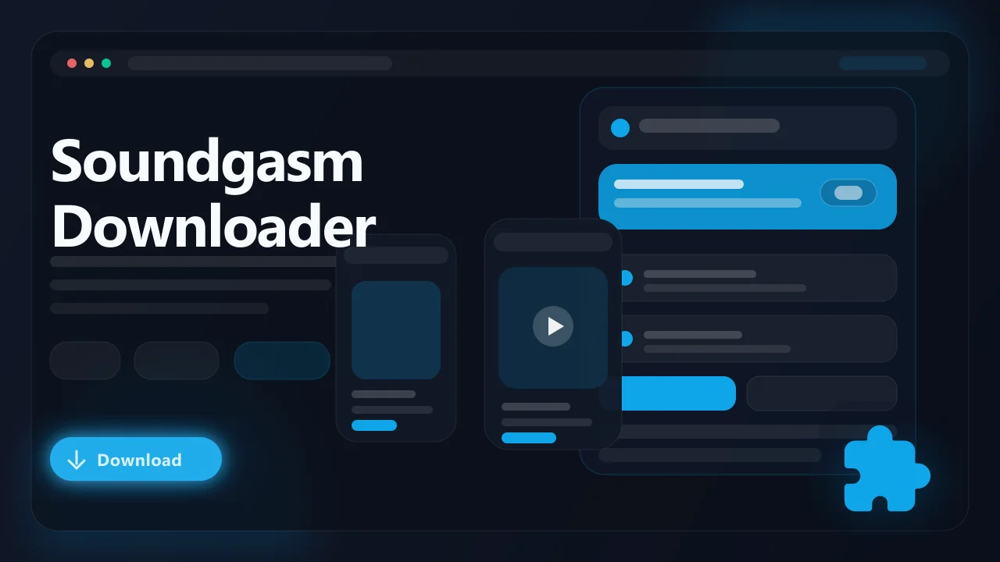

# Soundgasm Video Downloader (Browser Extension)

> Save Soundgasm audio recordings as local MP3 or M4A files directly from your browser.

Soundgasm Downloader is a browser extension built for people who want a simple way to save audio from Soundgasm pages without using third-party converter sites, screen recorders, or command-line tools. It works inside the browser, detects supported Soundgasm audio sources, and saves recordings as standard audio files for offline playback.

- Detect supported audio on Soundgasm track pages
- Save recordings as MP3 or M4A files, depending on the source
- Use a browser-native workflow with no external desktop software
- Keep files available for offline listening, backups, and personal archives
- Works with Chrome, Edge, Brave, Opera, Firefox, and other Chromium browsers

## Links

- :rocket: Get it here: [Soundgasm Downloader](https://serp.ly/soundgasm-downloader?via=github)
- :new: Latest release: [GitHub Releases](https://github.com/serpapps/soundgasm-downloader/releases/latest)
- :question: Help center: [SERP Help](https://help.serp.co/en/)
- :beetle: Report bugs: [GitHub Issues](https://github.com/serpapps/soundgasm-downloader/issues)
- :bulb: Request features: [Feature Requests](https://github.com/serpapps/soundgasm-downloader/issues)

## Preview

## Table of Contents

- [Why Soundgasm Downloader](#why-soundgasm-downloader)
- [Features](#features)
- [How It Works](#how-it-works)
- [Step-by-Step Tutorial: How to Download Soundgasm Audio](#step-by-step-tutorial-how-to-download-soundgasm-audio)
- [Supported Formats](#supported-formats)
- [Who It's For](#who-its-for)
- [Common Use Cases](#common-use-cases)
- [Troubleshooting](#troubleshooting)
- [Trial & Access](#trial--access)
- [Installation Instructions](#installation-instructions)
- [FAQ](#faq)
- [Notes](#notes)
- [License](#license)
- [About Soundgasm](#about-soundgasm)

## Why Soundgasm Downloader

Soundgasm is designed for listening in the browser. Recordings play through an embedded audio player, but most pages do not provide a clear download button or a simple export workflow. If you want a local copy of a recording you are allowed to save, the usual alternatives are awkward: inspect the page source, hunt for direct media URLs, paste links into third-party sites, or record the browser output in real time.

Soundgasm Downloader removes that friction. The extension focuses on the active Soundgasm page, detects supported audio sources exposed to the browser, and lets you save the recording as a normal file on your computer. The goal is a cleaner workflow for offline listening and personal archiving without leaving the browser.

## Features

- Automatic detection for supported Soundgasm audio pages
- One-click download flow from the extension popup
- Output as MP3 or M4A depending on the original hosted file
- Filename handling based on available page and track details
- Progress feedback while longer recordings download
- Browser-native saving through your normal Downloads folder
- No external converter website or desktop recorder required
- Cross-browser support for Chrome, Edge, Brave, Opera, Firefox, and compatible Chromium browsers

## How It Works

1. Install the extension from the latest release.
2. Open Soundgasm in your browser.
3. Navigate to a supported user recording page.
4. Let the audio player and page content load.
5. Click the extension icon to open the popup.
6. Review the detected audio item.
7. Start the download and save the file locally.
8. Open the saved MP3 or M4A from your Downloads folder.

## Step-by-Step Tutorial: How to Download Soundgasm Audio

1. Install Soundgasm Downloader from the latest GitHub release.
2. Open a Soundgasm recording page in a supported browser.
3. Wait for the page's audio player to load. If the recording has not initialized yet, press play briefly so the browser can see the audio source.
4. Click the Soundgasm Downloader extension button.
5. Confirm that the popup shows the detected recording.
6. Click Download.
7. Wait for the progress indicator to finish.
8. Find the saved audio file in your browser's Downloads folder.

## Supported Formats

- Input: Supported Soundgasm hosted audio files
- Output: MP3 or M4A, preserving the source format where possible

The extension does not promise higher quality than the source provides. Saved files are intended to match the audio available from the Soundgasm page.

## Who It's For

- ASMR listeners who want offline access to favorite recordings
- Creators backing up their own Soundgasm uploads
- Users with unreliable internet access who prefer local playback
- Researchers and students collecting audio samples they have permission to save
- Anyone who wants a browser-based alternative to manual URL extraction

## Common Use Cases

- Save a favorite ASMR recording before traveling
- Back up your own Soundgasm uploads to a local drive
- Keep personal audio references organized outside the browser
- Revisit recordings later without streaming them every time
- Avoid third-party converter sites when saving audio you have rights to download

## Troubleshooting

**The extension does not detect audio**  
Refresh the Soundgasm page, wait for the player to finish loading, and try playing the recording briefly before opening the popup.

**The download does not start**  
Check that your browser allows downloads from extensions and that the recording is accessible in the current tab.

**The file name looks generic**  
Some pages expose limited metadata. Rename the file after download if the page does not provide enough title or uploader detail.

**The saved quality is lower than expected**  
The extension saves the audio source made available by Soundgasm. It cannot create a higher-quality file than the hosted recording.

## Trial & Access

- Includes a limited free trial so you can test the workflow first
- Email sign-in uses one-time password verification
- Unlimited downloads are available with a paid license

Start here: [https://serp.ly/soundgasm-downloader?via=github](https://serp.ly/soundgasm-downloader?via=github)

## Installation Instructions

1. Open the latest release page:
   [https://github.com/serpapps/soundgasm-downloader/releases/latest](https://github.com/serpapps/soundgasm-downloader/releases/latest)
2. Download the extension build for your browser.
3. Install or load the extension in your browser.
4. Open Soundgasm and navigate to a supported recording page.
5. Use the popup to detect and download the audio.

## FAQ

**What can I download?**  
Supported Soundgasm audio recordings that are available to your active browser session.

**Does it download video?**  
No. Soundgasm Downloader is focused on audio recordings.

**Can I download from profile pages in bulk?**  
The primary workflow is individual recording pages. Profile-page behavior depends on how the page loads and exposes recordings in the browser.

**Where are files saved?**  
Files are saved through your browser's normal download system, usually into your Downloads folder.

**Do I need extra software?**  
No. The workflow runs through the browser extension.

**Is it free?**  
The extension includes a trial. Continued or unlimited use may require a paid license.

## Notes

- Only download content you own or have explicit permission to save
- Audio quality depends on the original file hosted by Soundgasm
- Soundgasm platform changes may affect detection or download behavior
- An active internet connection is required to access and download audio from the site

## License

This repository is distributed under the proprietary SERP Apps license in the [LICENSE](LICENSE) file. Review that file before copying, modifying, or redistributing any part of this project.

## About Soundgasm

Soundgasm is an audio hosting platform commonly used for ASMR recordings, voice clips, and other spoken-word or ambient audio. Creators publish recordings to profile and track pages, and listeners stream them through an embedded browser player. Soundgasm Downloader provides a focused browser-extension workflow for saving supported audio locally when you have the right to download it.
